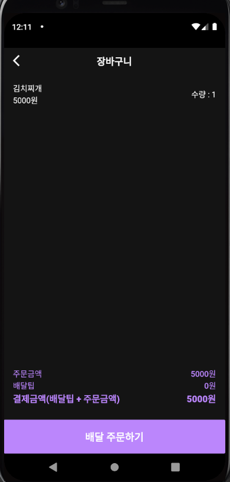
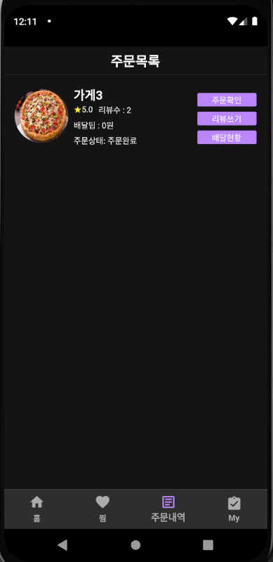
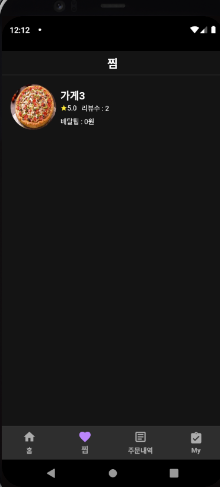

# 한강드론배달어플(윙윙이)
이 프로젝트는 졸업작품 전시회에 제출하기 위해 만든 프로젝트입니다.

약 2주 정도의 작업으로 만들었고, 이 프로젝트는 react native + django + sqlite로 구성되어있던 프로젝트를 flutter + firebase로 수정하였고, 아키텍처를 좀 더 효율적으로 구성하여 유지보수를 편하게 할 수 있도록 하였습니다.

### <프로젝트 요약>

앞으로 드론으로 배달을 하는 어플이 필요할 것이라는 생각에 만들게 되었습니다. 드론으로 배달하기 위한 시스템이 구축될 때 어떻게 진행될지 생각하고 배달의 과정이 어떻게 진행될지 생각하며 만들었습니다. 찜, 주문내역, 리뷰 등을 구현하였고, 실제 배달이 이루어질 때처럼 시뮬레이션을 할 수 있도록 하였습니다. 

### <아키텍처>

### <프로젝트 설명>

### <프로젝트 실제 모습>

